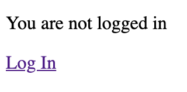
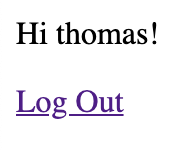
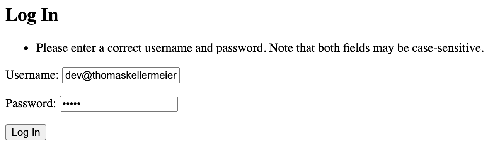

# Django Tutorial - Use Mail for Login

## Setup
[Source](https://docs.djangoproject.com/en/3.2/intro/tutorial01/)

### 1. Install Dependencies
```bash
$ python3 -m pip install virtualenv django
$ python3 -m virtualenv venv
```

### 2. Bootstrap Codebase With Virtualenv
```bash
$ django-admin startproject mysite
$ mv mysite django-mail-login
$ cd django-mail-login
$ virtualenv venv && source venv/bin/activate
(venv) $ pip install django
(venv) $ python -m django --version
> 4.0
```

### 3. Start Server
```
python manage.py migrate
python manage.py runserver
```

Go to [http://127.0.0.1:8000/](http://127.0.0.1:8000/)

### 4. Enable authentication

[Old Source](https://developer.mozilla.org/en-US/docs/Learn/Server-side/Django/Authentication#enabling_authentication)

[Source](https://learndjango.com/tutorials/django-login-and-logout-tutorial)

- Include URLS from `django.contrib.auth.urls`
- Create templates folder and files (e.g. `django.contrib.auth.urls`)
- Configure templates (`DIRS` in `TEMPLATES`)
- Define `LOGIN_REDIRECT_URL`
- Create `templates/home.html` & `templates/base.html`, Update login template
- Add home template to `urls.py`


#### 4.1. Add Admin User
```
$ python manage.py createsuperuser
```

#### 4.2. Test Login & Logout

**Go to [http://127.0.0.1:8000/](http://127.0.0.1:8000/)**



**Click on "Log In"**


**Insert username and password for superadmin**



**After logout, try to login with email and password for superadmin**


